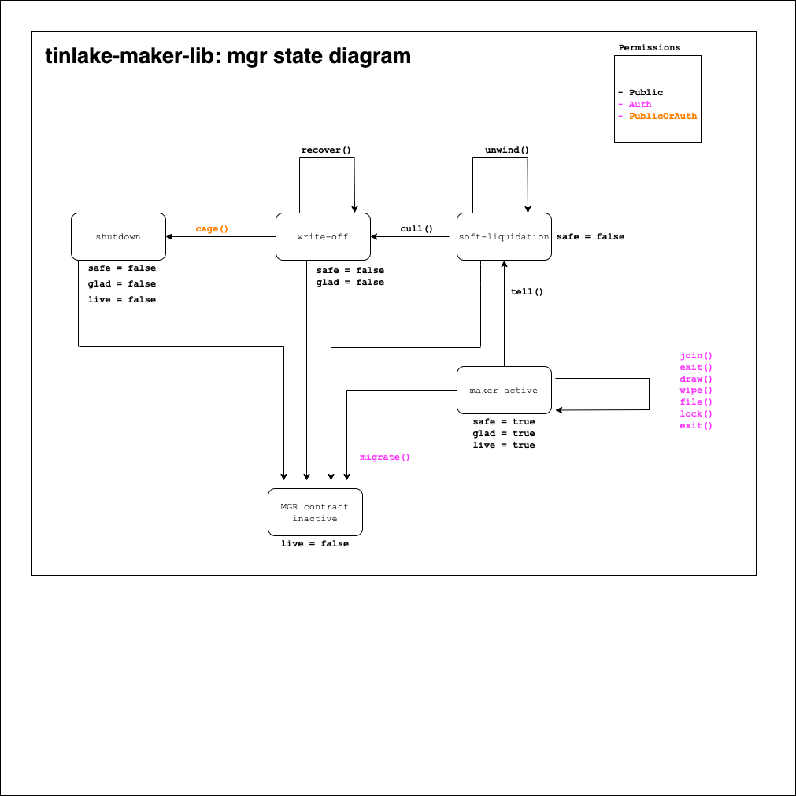

# Tinlake Manager

Implements the [MIP22](https://forum.makerdao.com/t/mip22-centrifuge-direct-liquidation-module/3930) for Maker RWA.
 
MIP22 is using the [MIP21](https://github.com/makerdao/MIP21-RWA-Example) contracts.

The MGR contract acts or implements the interfaces of the following MIP21 contracts
- RWA_OUTPUT_CONDUIT
- OPERATOR
- RWA_INPUT_CONDUIT

Liquidations are based on the MIP 21 RwaLiquidationOracle state which can only be changed by Maker governance.

## Interactions
- lock
    - locks the RWA token as collateral in DSS
- join
    - moves drop collateral into the MGR
- draw
    - draws DAI from DSS
- wipe
    - repays DAI to DSS
- exit
    - removes drop collateral from MGR 

## Soft liquidation
Tries to recover as much dai as possible without liquidating the cdp by calling
pool.disburse().

**Methods**
- tell
    - triggers a soft liquidation of the DROP collateral
    - requires a RwaLiquidationOracle tell state
- unwind
    - triggers the payout of a DROP redemption
    - method can be called multiple times until all DROP tokens are redeemed 

## Hard liquidation
This is essentially a write off of the debt of the vault based on the MIP21 oracle state.

**Methods**
- cull
    - can be called after RwaLiquidationOracle.cull()
    - changes the state to cull
- recover
    - triggers the payout of a DROP redemption
    - recovered DAI is moved into DSS as surplus

## DROP collateral
The drop collateral token (ERC20) is hold by the `MGR` contract.

## State Diagram
Different states of the MGR contract.
 

## Contracts Diagram
Contract diagrams of all relevant contracts which interact with the MGR contract.
 

# Spell

A mainnet targeted spell, integrating the manager and the drop token into maker
as a collateral type.

# Testing

RPC testing with `dapp test --rpc <ETH_RPC_URL>`.
Use `--cache` for rapid testing.
